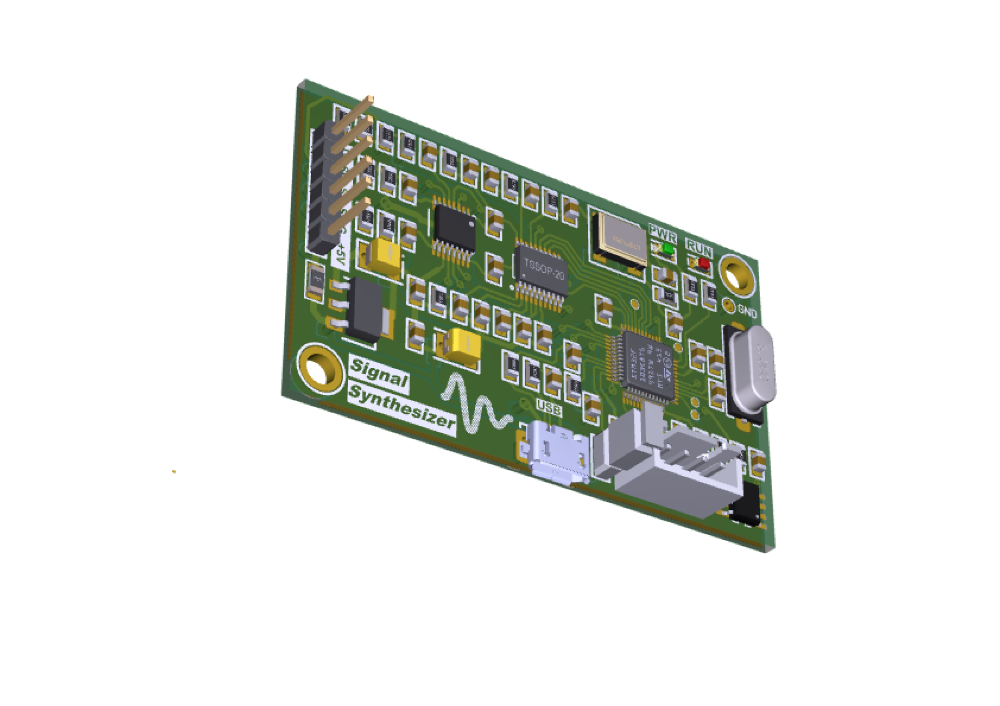
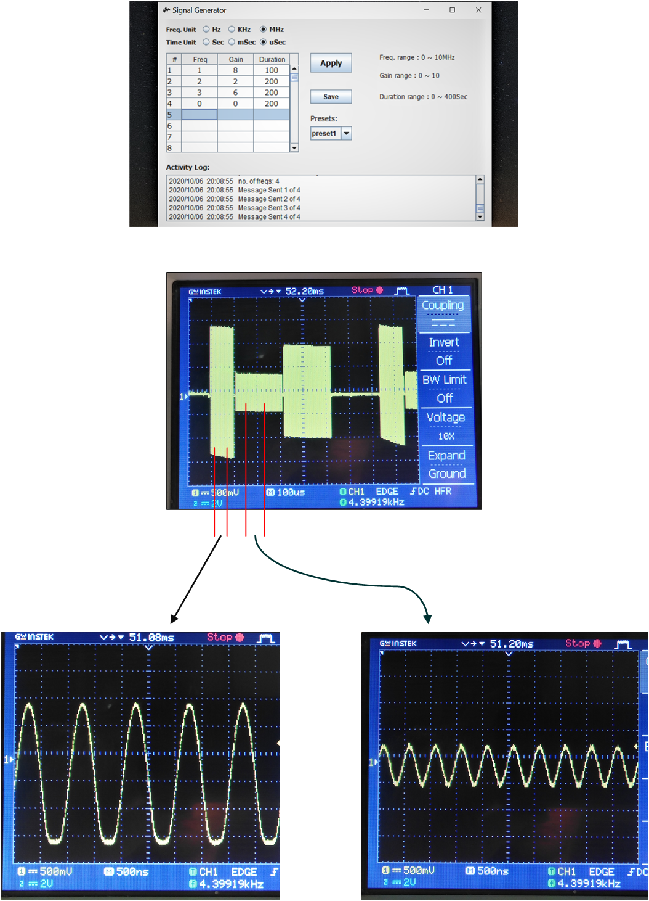

# 
A signal synthesizer with the capability of setting a single or a complex set of freqs with any desirable frequency & amplitude

This project is a complete set of signal generator including a hardware and software on PC. Output frequency ranges from 1Hz to 10MHz with a programmable peak-to-peak amplitude up to 3v. The hardware contains an ARM micro-controller, a DDS (Direct Digital Synthesizer) chip (AD9834 from Analog Devices) and a VGA (Variable Gain Amplifier) (AD8370 from Analog Devices).

Functional Block Digram:
 

On the hardware side a stm32f103c8t6 ARM micro-controller controls the DDS and VGA. Also, the stm32 chip has an interface with PC through USB (custom HID class). 
On the software side there is a Java application that interacts with user. On the app a freq/gain/time table is provided in order to set user values.\
The frequency ranges from 1Hz to 10MHz. The table can be saved up to 4 presets which facilitate the data reservation for later uses.\
\
The firmware has been developed through STM32CubeIDE and STM32CudeMX: [Firmware_main_quickview](Firmware_STM32F103c8t6/Src/main.c)
\
The Java application hosted on PC has been developed through NetBeansIDE:
[Java_main_quickview](Java_application/src/main_pack/MyJFrame.java)
 
Note that the Java application can run in both windows and Linux platform. 
 
The following show a snapshot of configuration by Java application which applies 3 signal with different freqs and amplitudes and durations. The results of output analog signal are shown as well. 
 
 

 
 

## Author:
### Hamid Reza Tanhaei

